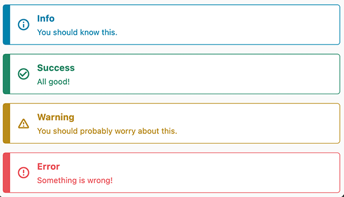

# AlertNotification

This package shows a simple alert for all the information your user should be
notified of.

### Default notification


### Outlined notification



## Features

* Title
* Subtitle
* Background Color
* Border and text color

## Upcoming Features

* Close button
* Richtext subtitle to include links
* Animation on show
* Animation on hide

## Usage

```dart
AlertNotification(
    title: 'Info',
    body: 'You should know this.',
    type: AlertNotificationType.info,
),

AlertNotification.outlined(
    title: 'Info',
    body: 'You should know this.',
    type: AlertNotificationType.info,
),
```

## Additional information

The Notification will take all available horizontal space.
